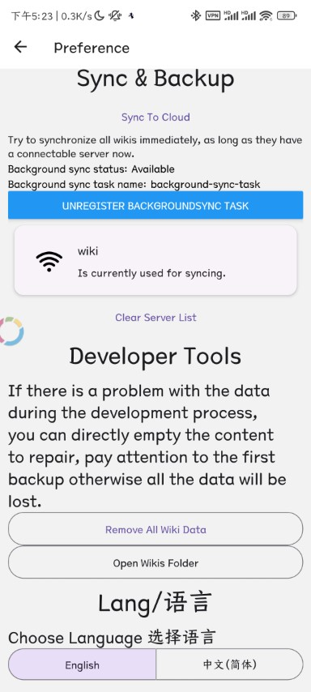
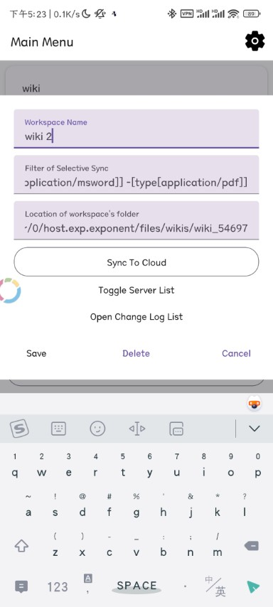

# TidGi Mobile

Mobile Tiddlywiki app that lazy-load local-first tid/md file, and sync with TidGi-Desktop.

## Usage

Install [tw-mobile-sync](https://github.com/tiddly-gittly/tw-mobile-sync) plugin.

tw-mobile-sync >= **0.6.0** works with TidGi-Mobile **v0.2**

## Screenshots

<!--- table generated by https://www.tablesgenerator.com/markdown_tables -->

Adding Wiki by Scanning QR Code on [TidGi-Desktop](https://github.com/tiddly-gittly/TidGi-Desktop).

| Adding Wiki by Scanning QR                                                                       | Wiki UI in TidGi Mobile                                                                      |
|--------------------------------------------------------------------------------------------------|----------------------------------------------------------------------------------------------|
|  |  |

Switch Language on Preference, and edit server or wiki config in the list.

| Preference                                                                                       | Edit Wiki list item by long press                                                            |
|--------------------------------------------------------------------------------------------------|----------------------------------------------------------------------------------------------|
|  |  |

More Screenshots on [docs/images/Screenshots](./docs/images/Screenshots)

## How it stores and uses data

When sync from a TidGi-Desktop app:

1. HTML, contains some of core tw things like `$:/boot` and raw HTMLs
    1. To update tiddlywiki version or those raw HTMLs, you need to perform a full-resync
1. SQLite, when adding wiki, we fetch all skinny-tiddlers of your tid/md file, then store them in SQLite DB to speedup booting and save memory.
1. JSON, when adding wiki, we fetch all plugins's full content as JSON, this will not be updated
1. Files, binary files like images are stored as files on your phone.

 a HTML with all plugins and skinny-tiddlers are store in the Mobile storage. And we also sync all tid/md file from your Desktop App to the Mobile storage.

Later, we use a Sync-Adaptor to only load the file you need lazily, to increase performance on huge wiki.

Currently only tiddlers in SQLite are synced back to TidGi-Desktop, HTML and JSON is never changed. So if you want to add plugins, you need to add it on Desktop, and a full resync from TidGi-Desktop is required.

## Permissions

1. Notification: We use notification to switch between full screen wiki and menu, also allow plugin to show notification.
