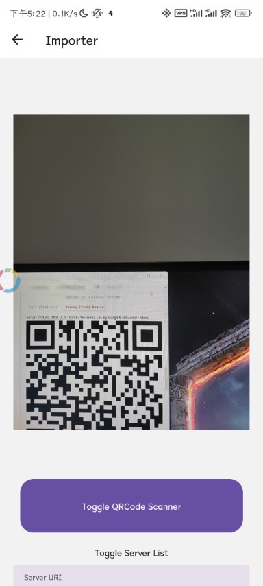
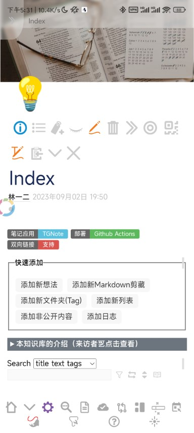
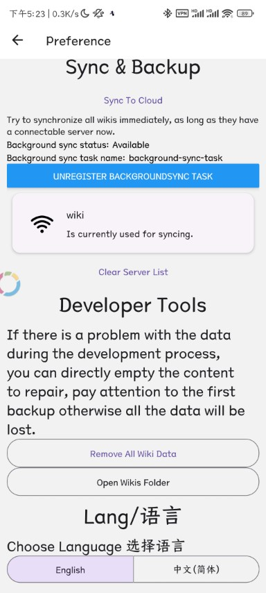
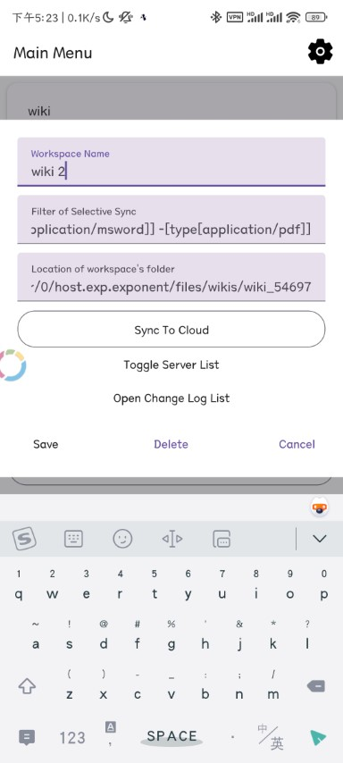

# TidGi Mobile

### [Open Official Website](https://tidgi.fun/#:TidGi-Mobile)

Mobile Tiddlywiki app is A Note App that is local-first, uses tid/md pure text file, all-in-one with calendar/todo/diary widget, lazy-loading, backlink & outline & Zettelkasten, and syncs with the open-source [TidGi-Desktop](https://github.com/tiddly-gittly/TidGi-Desktop).

## Screenshots

<!--- table generated by https://www.tablesgenerator.com/markdown_tables -->

Adding Wiki by Scanning QR Code on [TidGi-Desktop](https://github.com/tiddly-gittly/TidGi-Desktop).

| Adding Wiki by Scanning QR                                                                       | Wiki UI in TidGi Mobile                                                                      |
|--------------------------------------------------------------------------------------------------|----------------------------------------------------------------------------------------------|
|  |  |

Switch Language on Preference, and edit server or wiki config in the list.

| Preference                                                                                       | Edit Wiki list item by long press                                                            |
|--------------------------------------------------------------------------------------------------|----------------------------------------------------------------------------------------------|
|  |  |

More Screenshots on [metadata/en-US/images/phoneScreenshots/](./metadata/en-US/images/phoneScreenshots/)

## Usage

Install [tw-mobile-sync](https://github.com/tiddly-gittly/tw-mobile-sync) plugin.

tw-mobile-sync >= **0.6.0** works with TidGi-Mobile >= **v0.3**

## Privacy: How it stores and uses data

We do not send any information from your phone to the internet.

You can optionally syncing data from your phone to a local TidGi-Desktop app on your local WiFi.

### How it stores data locally on your phone

This is a local-first app, it stores data in following format, and never leaving your local WiFi network:

1. HTML, contains some of core tw things like `$:/boot` and raw HTML created by [$:/tags/RawMarkup](https://tiddlywiki.com/#SystemTag%3A%20%24%3A%2Ftags%2FRawMarkup)
    1. To update the TiddlyWiki version or the raw markup, you need to perform a full-resync (delete and recreate)
1. SQLite, When adding wiki, we fetch all skinny-tiddlers of your tid/md file, then store them in SQLite DB to speed up booting and save memory.
1. JSON, When adding wiki, we fetch all plugins's full content as JSON, this will not be updated
1. Files, binary files like images are stored as files on your phone.

Later, we use a Sync-Adaptor to only load the file you need lazily, to increase performance on a huge wiki. Also, reduce the memory and CPU consumption of your phone.

### Drawbacks

Currently, only normal tiddlers in SQLite are certainly synced back to TidGi-Desktop. HTML Javascript tiddler, and JSON plugins are never tested (Feel free to have a try and report to me!). So if you want to add new plugins, you may need to backup data to Desktop, add plugins on Desktop, and perform a full resync (delete and recreate) from TidGi-Desktop (If this is not necessary, report to me!).

## Permissions

1. Only requires for camera permission to scan QR code for sync URL from your local server.
